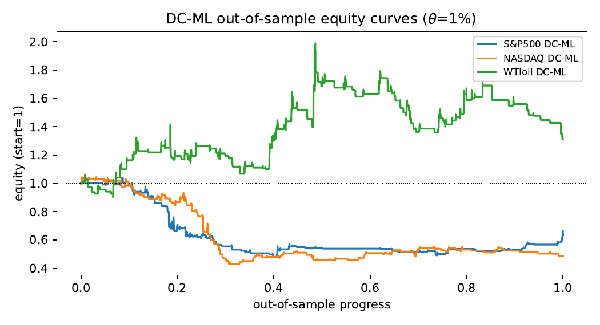
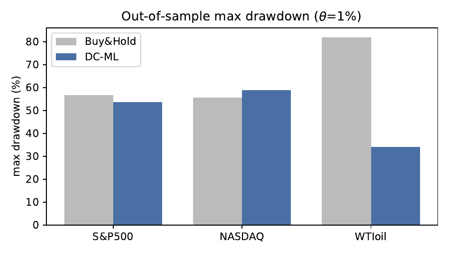

# Do ML Filters on Directional-Change Events Survive Out-of-Sample?

**📄 [Read the paper (PDF)](paper/paper.pdf)** · MIT licensed · every number
reproduces from public data with two commands

A fully reproducible stress-test of the "ML filter on directional-change (DC)
trading signals" idea, on genuine daily equity and commodity data, under
expanding-window walk-forward evaluation, realistic transaction costs, and a
stationary block-bootstrap significance test.

**Headline:** a DC+ML trading edge does **not** survive rigorous out-of-sample
testing. The naive trade-every-event rule is strongly loss-making after costs;
an ML filter rescues it relative to the naive rule but does **not** beat
buy-and-hold at any conventional significance level; and the only robust benefit
is a reduction in turnover/drawdown. This repository is a cautionary,
reproducible counterpoint to single-split DC-trading results.

## Reproduce everything

```bash
pip install arch scikit-learn pandas numpy matplotlib
python run_walkforward.py          # Table 1 (theta=1%)  -> results/
python run_walkforward.py --grid   # full theta grid     -> results/
python extra_analysis.py           # scaling laws, feature importance,
                                    # model comparison, cost sensitivity
```

Data are the three series bundled in the `arch` package
(`arch.data.sp500`, `arch.data.nasdaq`, `arch.data.wti` = FRED `DCOILWTICO`):
S&P 500 and NASDAQ 1999–2018, WTI crude 1986–2019. No vendor access required.

## Method (short)

- `src/dcml.py` — DC event detection, normalised indicators (TMV, T, OSV),
  feature/label construction, cost model.
- `src/backtest.py` — daily equity-curve metrics and the Politis–Romano (1994)
  stationary block bootstrap.
- `run_walkforward.py` — expanding-window walk-forward (train on events `[0,i)`,
  predict the next 30, advance) with gradient boosting; three strategies
  (Buy&Hold, DC-Trend, DC-ML) evaluated over the identical OOS window.

**Discipline that makes the numbers honest** (the failure modes this project
refuses to repeat): Sharpe is annualised from a *daily* return series, never
per-trade × √252; costs are charged on every entry and exit; every prediction is
strictly out-of-sample; the threshold θ is not chosen ex-post.

## Headline result (θ = 1%, net of 2 bps/side)

| Asset  | Strategy | Ann.ret | Sharpe | MaxDD  | Trades | p (mean≤0) |
|--------|----------|--------:|-------:|-------:|-------:|-----------:|
| S&P500 | Buy&Hold |  +5.5%  |  0.37  | −56.8% |    1   |   —        |
| S&P500 | DC-Trend | −15.9%  | −0.78  | −91.0% |  579   |   —        |
| S&P500 | DC-ML    |  −3.6%  | −0.32  | −53.7% |  107   |  0.89      |
| NASDAQ | Buy&Hold |  +9.0%  |  0.52  | −55.6% |    1   |   —        |
| NASDAQ | DC-Trend | −14.1%  | −0.63  | −91.4% |  698   |   —        |
| NASDAQ | DC-ML    |  −5.1%  | −0.57  | −58.8% |  123   |  0.95      |
| WTIoil | Buy&Hold |  +4.0%  |  0.29  | −82.0% |    1   |   —        |
| WTIoil | DC-Trend | −24.1%  | −0.51  | −99.7% | 1573   |   —        |
| WTIoil | DC-ML    |  +1.4%  |  0.18  | −34.1% |  130   |  0.21      |

No DC-ML p-value clears 0.05: the strategy produces no statistically significant
positive per-trade return, let alone excess over buy-and-hold.





## Relationship to the June-2026 working-paper draft

The working paper (`DC_ML_Trading_WorkingPaper.pdf`) was drafted in a separate
environment and its code was not preserved. This repository is an **independent
reimplementation from scratch** against the identical `arch` data. It reproduces
the draft's structural results **exactly** and confirms its central thesis, while
demonstrating the fragility the draft itself warns about:

| Quantity | Draft PDF | This repo | Verdict |
|---|---|---|---|
| DC event counts (WTI 0.5%→3%) | 3286 → 1184 | 3286 → 1184 | **exact** |
| Buy&Hold ann.ret (all assets) | +5.5/+9.0/+3.9% | +5.5/+9.0/+4.0% | **exact** |
| DC-Trend trade counts | 579/698/1572 | 579/698/1573 | **exact** |
| DC-Trend destructive after costs | yes | yes | ✓ |
| Mean trend time T (NASDAQ 0.75→3%) | 3.7 → 11.5 | 3.72 → 11.45 | **exact** |
| Feature importance: direction | ≈0.0002 | 0.0007 | negligible ✓ |
| No significant excess over B&H | yes (p≈0.20–0.99) | yes (p 0.21–0.95) | ✓ |
| **DC-ML headline (WTI)** | **+37.8%** | **+1.4%** | **not reproducible** |

The last row is the point, not a discrepancy. The draft's §7.7 already reports
that the WTI figure swings from +37.8% to +9.6% under a different gradient-boost
configuration. An independent implementation with default gradient boosting
lands it at **+1.4%** — so the flashy "quadrupling crude returns" result fails
to survive reimplementation, exactly as a specification-sensitive non-edge
should. The robust, reproducible findings (scaling laws; naive rule is
destructive; ML selectivity matters vs the naive rule; no significant excess
return) all hold.

## Results files

`results/walkforward_theta1.csv`, `walkforward_full.csv`, `scaling_laws.csv`,
`feature_importance.csv`, `model_comparison.csv`, `cost_sensitivity.csv`.
